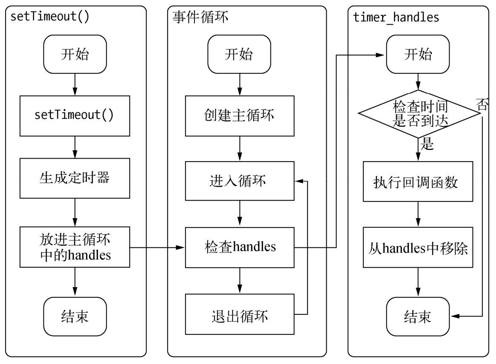

## 深入浅出node.js

### 发布 npm包
1. 创建`hello.js`
   ```js
   exports.sayHello = function() {
       return 'hello world'
   }
   ```
2. 初始化描述文件 `npm init`, npm 通过提问交互填写选项,完成描述文件
    ```json
    {
        "name": "hello_package",
        "version": "1.0.0",
        "description": "",
        "main": "hello.js",
        "scripts": {
        "test": "echo \"Error: no test specified\" && exit 1"
        },
        "author": "",
        "license": "ISC"
    }
    ```
3. 注册包仓库账号
    - npm adduser
    依次填写账号,邮箱
4. 发布包 `npm publish .`
   - 推送带tag的版本 `npm publish --tag [tagName]`
     - 安装带tag的版本 `npm install [package]@[tagName]`
   - 如果预设了私有仓库(一般企业中会用到),包将直接发布到私有仓库,否则才发布到公共仓库
   - 搭建[搭建私有仓库](https://verdaccio.org/), 可使用`verdaccio`
   - **注:** 每次推送后,version需要+1进行修改
    ```
    npm notice 
    npm notice package: hello_package@1.0.1
    npm notice === Tarball Contents ===    
    npm notice 60B  hello.js    
    npm notice 209B package.json
    npm notice === Tarball Details ===     
    npm notice name:          hello_package
    npm notice version:       1.0.1
    npm notice package size:  319 B
    npm notice unpacked size: 269 B
    npm notice shasum:        7dc90ee0e23ebb095a60a9192e8601e9ceeb5709
    npm notice integrity:     sha512-ViQmd+Be+nDsz[...]aR4T3uRENReGg==
    npm notice total files:   2
    npm notice
    + hello_package@1.0.1
    ```

    ### 使用
    > **process** 获取当前进程信息

    > **platform** 获取当前平台信息,区分系统. (windows > win32, mac > darwin)

    >**argv** 用户传入的参数

    > **cwd** 当前执行的所处路径

    ### 事件循环
    `在进程启动时，Node便会创建一个类似于while(true)的循环，每执行一次循环体的过程我们称为Tick。每个Tick的过程就是查看是否有事件待处理，如果有，就取出事件及其相关的回调函数。如果存在关联的回调函数，就执行它们。然后进入下个循环，如果不再有事件处理，就退出进程。`

    ### 观察者
    `每个事件循环中有一个或者多个观察者，而判断是否有事件要处理的过程就是向这些观察者询问是否有要处理的事件。`
    
    ### 定时器
    setTimeout()和setInterval()与浏览器中的API是一致的,实现原理与异步I/O比较类似,只是不需要I/O线程池的参与.调用setIimeout()或者setInterval()**创建的定时器会被插入到定时器观察者内部的一个红黑树中**.每次Tick执行时,会从该红黑树中迭代取出定时器对象,检查是否超过定时时间,如果超过,就形成一个事件,它的回调函数将立即执行.
    > 以下为setTimeout执行流程(来源: 深入浅出node.js)

    
    需要注意的是,定时器的**执行间隔并非精确**,举个栗子,譬如通过setTimeout()设定一个任务在10毫秒后执行，但是在9毫秒后，有一个任务占用了5毫秒的CPU时间片，再次轮到定时器执行时，时间就已经过期4毫秒。


### 内存
v8引擎的内存由`新生代内存`和`老生代内存`组成,在不同的系统下内存分配的大小不同,
32位系统: 新生代 > 16MB, 老生代 > 700MB 
64位系统: 新生代 > 32MB, 老生代 > 1400MB

同时内存又分为`堆内内存`与`堆外内存`,老生代与新生代就属于堆内内存,像声明的变量就分配到堆内内存里了,`buffer`这种数据比较特殊,就分配到堆外内存了.

### Buffer

正确的Buffer拼接
```js
var chunks = [];
var size = 0;
res.on('data', function (chunk) {
    chunks.push(chunk);
    size += chunk.length;
});
res.on('end', function () {
    var buf = Buffer.concat(chunks, size);
    var str = iconv.decode(buf, 'utf8');
    console.log(str);
});
```