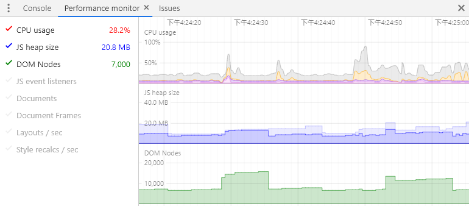

## 网页性能优化
##### 案例
* mac chrome浏览器同时打开几个网页,导致页面白屏,直接卡死
1. 检查调试, 打开浏览器开发者工具 > 右上角三个点 > more tools > Performance monitor

cpu占比一直在20%以上无法下降

2. 排除, 首先从定时器下手,关闭页面所有`setInterval``setTimeout`,怀疑是高频率的回流造成的
    ```
    for (let i = 0; i < 1000; i++){  clearInterval(i) }
    ```
    发现cpu并没有下降。
3. 逐步剔除模块,最终定位到一个带有`animation`动画的元素上,只要关闭`animation`,cpu立马下降,查看文档发现,无限循环的`animation`会一直占用cpu
4. 优化方案
   1. 魔法属性:`transform: translateZ(0);` 这会将元素组合到各自的层中,通过欺骗浏览器以为它将进行3D变换,可开启GPU加速功能,减少CPU消耗
   2. `will-change: tranform`, 告知浏览器该元素会有哪些变化的方法，这样浏览器可以在元素属性真正发生变化之前提前做好对应的优化准备工作。 这种优化可以将一部分复杂的计算工作提前准备好，使页面的反应更为快速灵敏。